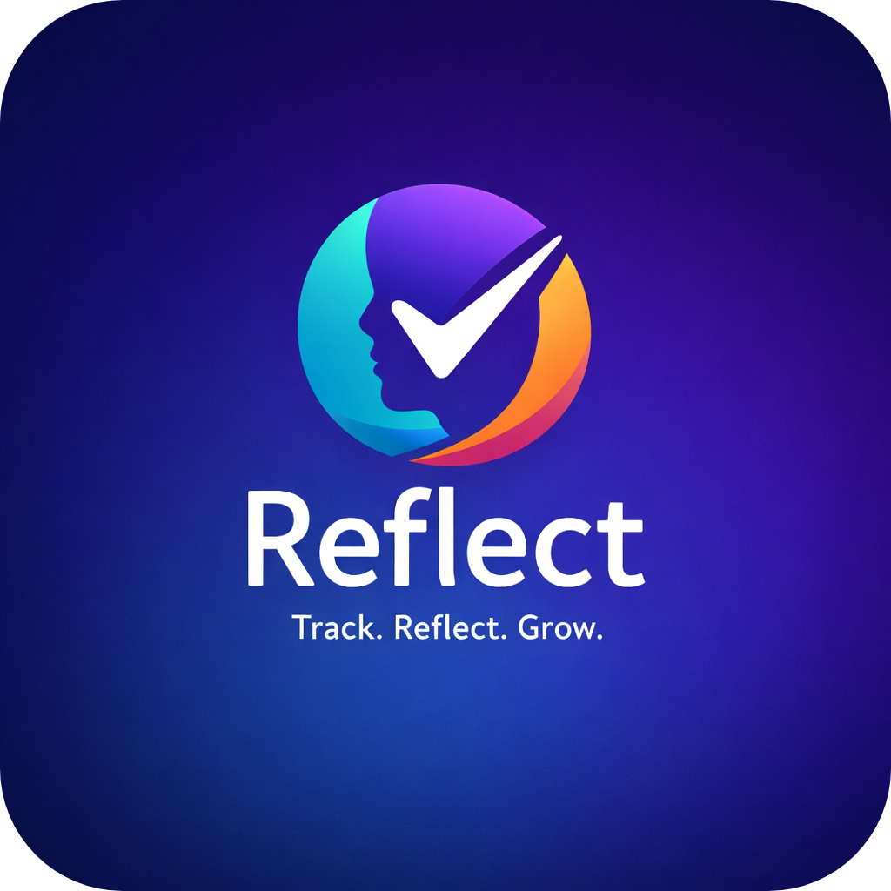

<div align="center">



# Reflect

### *Track. Reflect. Grow.*

[](https://developer.android.com)
[](https://www.java.com)
[](https://developer.android.com/training/data-storage/room)
[](https://m3.material.io)
[](https://developers.google.com/identity)
[](https://www.tensorflow.org/lite)
[](https://www.figma.com/design/Td2oz592yq6aNDssoqYxMq/REFLECT-MOBILE-APP?node-id=0-1&t=ntP8JgXwgVIoP7fr-1)
[](LICENSE)

> **Module:** ICT3214 — Mobile Application Development
>
> **Project Idea:** Personal Goal Reflection App (#8)
>
> **UI Design:** [View Figma Prototype →](https://www.figma.com/design/Td2oz592yq6aNDssoqYxMq/REFLECT-MOBILE-APP?node-id=0-1&t=ntP8JgXwgVIoP7fr-1)

</div>

---

## 📖 About Reflect

**Reflect** is a mindful personal goal journaling app built for Android.
It gives users a calm, distraction-free space to **write their goals**, **add periodic reflection notes**, **log journal reflections with mood tracking**, and **track their personal growth** — all stored privately per user on the device using a local Room database.

Unlike complex productivity apps, Reflect is intentionally minimal.
It's about **thinking deeply**, not managing tasks.

---

## ✨ Features Implemented

| Feature | Status | Description |
|---|---|---|
| 💫 **Splash Screen** | ✅ Done | Animated branded loading screen with the Reflect logo, progress bar, routes by session/onboarding state |
| 🎓 **Onboarding** | ✅ Done | 3-page swipeable intro with ViewPager2, skip support, shown only once |
| 🔐 **Register** | ✅ Done | Full validation, SHA-256 password hashing, Room DB insert, auto-login on success |
| 🔑 **Login** | ✅ Done | Email/password auth against Room DB, session creation |
| 🔵 **Google Sign-In** | ✅ Done | One-tap Google sign-in via Credential Manager API — auto-registers on first use |
| 🖼️ **Google Profile Photo** | ✅ Done | Google account photo loaded via Glide with CircleCrop on Home & Profile |
| 🔓 **Forgot Password** | ✅ Done | 2-step flow: verify email → set new password → success screen |
| 🏠 **Home Dashboard** | ✅ Done | Stats cards, inspiration quote, dynamic progress chart (today highlighted), recent activity from DB |
| 🎯 **Goals Tab** | ✅ Done | Fragment-based tab — full goals list with filter chips (All / Active / Completed), goal cards with progress |
| ➕ **Add Goal** | ✅ Done | Title, description, category dropdown, priority selector (Low/Medium/High), date picker for deadline |
| ✏️ **Edit Goal** | ✅ Done | Full edit screen pre-filled with all existing goal data |
| 📋 **Goal Details** | ✅ Done | Full goal info, mark as achieved/active, add reflection notes inline, edit and delete |
| 📓 **Reflection Journal** | ✅ Done | Fragment-based Journal tab — mood-tagged entries, filter chips (All / This Week / This Month / Favorites), long-press to favorite |
| ➕ **Add Reflection** | ✅ Done | Title, mood picker (Happy / Calm / Neutral / Sad / Anxious), full content entry, saves to Room DB |
| 🤖 **AI Mood Detection** | ✅ Done | On-device TFLite model auto-detects mood from journal text — confidence bars + emoji displayed; falls back to keyword matching if no model loaded |
| 👤 **Profile & Settings** | ✅ Done | Avatar, dark mode toggle, notifications toggle with runtime permission flow, account rows, logout |
| 📸 **Profile Photo Update** | ✅ Done | Choose from gallery (Photo Picker) or capture with camera — saved to private storage |
| 🪪 **Personal Details** | ✅ Done | Edit name, view email, change password with current password verification, delete account |
| 💳 **Subscription Screen** | ✅ Done | Plan overview UI screen |
| ❓ **Help & Support** | ✅ Done | FAQ and support contact screen |
| 🌙 **Dark / Light Theme** | ✅ Done | Follows device system theme live — switches across all screens instantly |
| 🔔 **Notifications Toggle** | ✅ Done | Runtime permission request (Android 13+), toggle persists across app restarts |
| 📱 **Session Management** | ✅ Done | Persistent login via `SharedPreferences`, auto-skip splash & onboarding |
| 🧭 **Single-Activity Navigation** | ✅ Done | `MainActivity` hosts Home / Goals / Journal / Profile as Fragments with a shared bottom nav bar |
| 🎨 **Reflect Logo** | ✅ Done | Custom `reflect_logo.png` applied as app launcher icon (all mipmap densities) and on every auth screen (Splash, Login, Register, Forgot Password) with rounded corners via `ShapeableImageView` |

---

## 🛠️ Tech Stack

| Layer | Technology | Version |
|---|---|---|
| **Language** | Java | 11 |
| **Platform** | Android | Min SDK 24 (Android 7.0+), Target SDK 36 |
| **UI Framework** | XML Layouts + Fragments | — |
| **Material Components** | Material Design 3 | `1.13.0` |
| **AppCompat / DayNight** | `androidx.appcompat` | `1.7.1` |
| **ConstraintLayout** | `androidx.constraintlayout` | `2.2.1` |
| **ViewPager2** | `androidx.viewpager2` | `1.1.0` |
| **Local Database** | Room Persistence Library | `2.6.1` |
| **Image Loading** | Glide | `4.16.0` |
| **Google Sign-In** | Credential Manager API | `1.5.0` |
| **Google ID Token** | `com.google.android.libraries.identity.googleid` | `1.1.1` |
| **On-Device AI** | TensorFlow Lite | `2.4.0` |
| **Model Training** | Google Colab (Python / TF Keras → TFLite) | — |
| **Password Security** | SHA-256 via `MessageDigest` | — |
| **Session Handling** | `SharedPreferences` — `SessionManager` | — |
| **Background Threading** | `ExecutorService` for all Room ops | — |
| **Build Tool** | Android Gradle Plugin | `9.0.1` |
| **IDE** | Android Studio | — |
| **Version Control** | Git & GitHub | — |

---

## 📱 App Architecture — Single-Activity + Fragments

`MainActivity` is a **single-Activity fragment host**. It owns the bottom navigation bar and the centre FAB. The four main tabs are **Fragments** swapped in and out of a `FrameLayout` container:

```
MainActivity (activity_main.xml)
│
├── FrameLayout (fragment_container)
│   ├── HomeFragment      ← fragment_home.xml
│   ├── GoalsFragment     ← fragment_goals.xml
│   ├── JournalFragment   ← fragment_journal.xml
│   └── ProfileFragment   ← fragment_profile.xml
│
└── Bottom Navigation Bar
    ├── 🏠 Home
    ├── 🎯 Goals
    ├── [+] Centre FAB  ← opens AddGoalActivity or AddReflectionActivity (context-aware)
    ├── 📓 Journal
    └── 👤 Profile
```

**Fragment refresh:** the centre FAB uses `ActivityResultLauncher` so whichever fragment is currently displayed automatically calls `loadData()` when returning with `RESULT_OK`.

**Back press:** if not already on Home, navigates back to Home tab. Home tab blocks exit — user must log out explicitly.

---

## 📱 App Flow & Screens

```
┌──────────────────┐
│  Splash Screen   │  Reflect logo + animated loading bar
└────────┬─────────┘
         ├─── [Session exists] ──────────────────────▶ MainActivity (Home tab)
         ├─── [Onboarding done, no session] ─────────▶ Login Screen
         └─── [First launch] ──────────────────────▶ Onboarding (3 pages)
                                                           │
                                          [Get Started] ──▶ Login Screen
┌──────────────────────────────────────────────────────────────────────────────┐
│                              Login Screen                                    │
│  • Reflect logo (rounded ShapeableImageView)                                 │
│  • Email / Password  •  Log In  •  Forgot Password?                          │
│  • 🔵 Google Sign-In (Credential Manager — fully functional)                 │
│  • "Register now" link                                                       │
└──────────┬──────────────────────────────────────────────────────────────────┘
           │ [success]
           ▼
┌──────────────────────────────────────────────────────────────────────────────┐
│                     MainActivity — Bottom Nav + Fragment Host                │
│                                                                              │
│  ┌─────────────────────────────────────────────────────────────────────┐    │
│  │  HOME TAB  (HomeFragment)                                           │    │
│  │  • Avatar + "Welcome back, [Name]"  •  Notification bell           │    │
│  │  • Empty state: "Add Your First Goal" button                        │    │
│  │  • Active Goals  •  Completed  •  Habits (circular ring)           │    │
│  │  • Daily Inspiration quote card                                     │    │
│  │  • Weekly bar chart (Mon–Sun, today highlighted)                    │    │
│  │  • Recent Activity feed — last 5 goals, tap → Goal Details          │    │
│  │  • "View All" → switches to Goals tab                               │    │
│  └─────────────────────────────────────────────────────────────────────┘    │
│                                                                              │
│  ┌─────────────────────────────────────────────────────────────────────┐    │
│  │  GOALS TAB  (GoalsFragment)                                         │    │
│  │  • Header "My Goals"                                                │    │
│  │  • Filter chips: All Goals | Active | Completed                     │    │
│  │  • Goal cards — icon, title, deadline, status badge, progress bar   │    │
│  │  • Tap card → GoalDetailsActivity                                   │    │
│  │  • Empty state when no goals match filter                           │    │
│  └─────────────────────────────────────────────────────────────────────┘    │
│                                                                              │
│  ┌─────────────────────────────────────────────────────────────────────┐    │
│  │  JOURNAL TAB  (JournalFragment)                                     │    │
│  │  • Header "Reflection Journal"                                      │    │
│  │  • Filter chips: All | This Week | This Month | ⭐ Favorites        │    │
│  │  • Journal entry cards — mood icon, title, date/time, content preview│   │
│  │  • Mood colour-coded icon boxes (Happy=Green, Sad=Amber,            │    │
│  │    Neutral=Blue, Anxious=Purple, Calm=Blue)                         │    │
│  │  • Long-press entry → toggle favorite (⭐)                          │    │
│  │  • Empty state when no entries                                      │    │
│  └─────────────────────────────────────────────────────────────────────┘    │
│                                                                              │
│  ┌─────────────────────────────────────────────────────────────────────┐    │
│  │  PROFILE TAB  (ProfileFragment)                                     │    │
│  │  • Avatar  •  User name  •  "Pro Member" badge                      │    │
│  │  • App Preferences: Dark Mode toggle, Notifications toggle          │    │
│  │  • Account: Personal Details ▶  Subscription ▶  Help & Support ▶   │    │
│  │  • Log Out button with confirmation dialog                          │    │
│  │  • Version text                                                     │    │
│  └─────────────────────────────────────────────────────────────────────┘    │
│                                                                              │
│  Bottom Nav: 🏠 Home | 🎯 Goals | [+FAB] | 📓 Journal | 👤 Profile          │
└──────────────────────────────────────────────────────────────────────────────┘
           │  [+ FAB on Goals/Home tab]          [+ FAB on Journal tab]
           ▼                                              ▼
┌──────────────────────────┐                ┌────────────────────────────────┐
│   Add Goal Activity      │                │    Add Reflection Activity     │
│  Title, Description,     │                │  Title, Mood picker            │
│  Category dropdown,      │                │  (Happy/Calm/Neutral/Sad/      │
│  Priority chips,         │                │   Anxious), full content       │
│  Deadline date picker    │                │  🤖 Detect Mood → AI analyses  │
│  → RESULT_OK → refresh   │                │  text, selects mood + shows    │
└──────────────────────────┘                │  confidence bars               │
                                            │  Saves to Room DB → RESULT_OK  │
                                            │  → refreshes JournalFragment   │
                                            └────────────────────────────────┘
           │  [tap goal card]
           ▼
┌──────────────────────────────────────────────────────────────────────────────┐
│                           Goal Details Screen                                │
│  Title, description, category badge, priority, deadline, created date       │
│  Circular progress ring (0% / 100%)  •  Mark as Achieved / Active toggle    │
│  Add Reflection button → inline dialog to append reflection note             │
│  Reflections list (each shown as a card)                                    │
│  Edit ▶ →  Edit Goal Screen (pre-filled, updates DB on save)                │
│  Delete → confirmation dialog → removes from DB → back to Goals tab         │
└──────────────────────────────────────────────────────────────────────────────┘
           │  [Profile → Personal Details]
           ▼
┌──────────────────────────────────────────────────────────────────────────────┐
│                         Personal Details Screen                              │
│  Avatar with edit pencil — Take Photo / Choose from Gallery / Remove Photo  │
│  Edit Full Name  •  Email (read-only)                                       │
│  Change Password: current → new → confirm  •  Delete Account                │
└──────────────────────────────────────────────────────────────────────────────┘
```

---

## 🗄️ Database Schema

Reflect uses the **Room Persistence Library** backed by SQLite.

### `users` table — `User.java`

| Column | Type | Description |
|---|---|---|
| `id` | `INTEGER PK` | Auto-generated user ID |
| `fullName` | `TEXT` | User's display name |
| `email` | `TEXT UNIQUE` | Login identifier |
| `passwordHash` | `TEXT` | SHA-256 hash, or `GOOGLE_AUTH_<hash>` for Google users |

### `goals` table — `Goal.java`

| Column | Type | Description |
|---|---|---|
| `id` | `INTEGER PK` | Auto-generated goal ID |
| `userId` | `INTEGER FK` | References `users(id)` |
| `title` | `TEXT` | Goal title |
| `description` | `TEXT` | Detailed description |
| `category` | `TEXT` | e.g. Personal Growth, Health & Fitness, Career & Finance |
| `priority` | `TEXT` | `low` / `medium` / `high` |
| `deadline` | `TEXT` | Target date (yyyy-MM-dd), nullable |
| `reflectionNotes` | `TEXT` | `\|\|`-delimited inline reflection entries |
| `isAchieved` | `INTEGER` | `0` = in progress, `1` = achieved |
| `createdAt` | `TEXT` | ISO date of creation |
| `updatedAt` | `TEXT` | ISO date of last update |

### `reflections` table — `Reflection.java`

| Column | Type | Description |
|---|---|---|
| `id` | `INTEGER PK` | Auto-generated reflection ID |
| `userId` | `INTEGER FK` | References `users(id)` |
| `title` | `TEXT` | Reflection title |
| `mood` | `TEXT` | `happy` / `calm` / `neutral` / `sad` / `anxious` |
| `content` | `TEXT` | Full reflection body text |
| `isFavorite` | `INTEGER` | `0` = normal, `1` = favorited |
| `createdAt` | `TEXT` | ISO datetime (`yyyy-MM-dd HH:mm:ss`) |

> 🔑 All queries are filtered by the logged-in user's ID — complete data privacy between accounts.

---

## 🌙 Dark / Light Theme

Reflect fully supports **system-driven dark and light mode**:

- Follows device theme automatically
- Switches **live** while the app is open
- Covers **every** screen across all activities and fragments
- Implemented via `AppCompatDelegate.MODE_NIGHT_FOLLOW_SYSTEM` in `ReflectApp.java`
- Profile screen **Dark Mode toggle** lets users override to force dark/light

| Token | Light | Dark |
|---|---|---|
| `colorAppBg` | `#F6F6F8` | `#111121` |
| `colorCard` | `#FFFFFF` | `#1E2035` |
| `colorTextPrimary` | `#0F172A` | `#FFFFFF` |
| `colorTextSecondary` | `#64748B` | `#94A3B8` |
| `colorBorder` | `#E2E8F0` | `#334155` |
| `colorNavBar` | `#F8FAFC` | `#1A1B2E` |

---

## 🎨 Logo & Branding

The `reflect_logo.png` is used as the app's visual identity across all entry points:

| Location | Implementation |
|---|---|
| **App launcher icon** | `reflect_logo.png` in all mipmap densities (`mdpi` → `xxxhdpi`) + adaptive icon foreground for API 26+ |
| **Splash Screen** | `ShapeableImageView` 68×68dp, `centerCrop`, `18dp` rounded corners, inside gradient logo box |
| **Login Screen** | `ShapeableImageView` 72×72dp, `centerCrop`, `18dp` rounded corners |
| **Register Screen** | `ShapeableImageView` 72×72dp, `centerCrop`, `18dp` rounded corners |
| **Forgot Password Screen** | `ShapeableImageView` 72×72dp, `centerCrop`, `18dp` rounded corners |

Rounded corners are applied via `@style/RoundedLogoShape` (`cornerFamily=rounded`, `cornerSize=18dp`) in `themes.xml`, ensuring the logo image is **pixel-perfectly clipped** — not just a rounded background behind a square image.

---

## 🗂️ Project Structure

```
REFLECT/
├── app/src/main/
│   ├── java/me/madhushan/reflect/
│   │   │
│   │   ├── ── Core App ──
│   │   ├── ReflectApp.java                   # Application class — sets DayNight mode system-wide
│   │   ├── MainActivity.java                 # Single-Activity host — bottom nav + fragment switcher + FAB launchers
│   │   │
│   │   ├── ── Auth & Onboarding ──
│   │   ├── SplashActivity.java               # Animated splash → routes to Onboarding / Login / Home
│   │   ├── OnboardingActivity.java           # 3-page ViewPager2 intro (shown once only)
│   │   ├── LoginActivity.java                # Email/password + Google Sign-In, session creation
│   │   ├── RegisterActivity.java             # Registration with validation + SHA-256 hashing
│   │   ├── ForgotPasswordActivity.java       # 2-step password reset (verify email → new password)
│   │   │
│   │   ├── ── Main Tab Fragments ──
│   │   ├── HomeFragment.java                 # Home tab — stats, bar chart, recent activity, empty state
│   │   ├── GoalsFragment.java                # Goals tab — filter chips, goal cards, progress bars
│   │   ├── JournalFragment.java              # Journal tab — mood entries, filter chips, long-press favorite
│   │   ├── ProfileFragment.java              # Profile tab — avatar, dark mode, notifications, logout
│   │   │
│   │   ├── ── Goal Screens ──
│   │   ├── AddGoalActivity.java              # Add new goal — title, description, category, priority, deadline
│   │   ├── EditGoalActivity.java             # Edit existing goal — pre-filled form, updates Room DB
│   │   ├── GoalDetailsActivity.java          # Goal detail — progress, reflections, mark achieved, edit, delete
│   │   │
│   │   ├── ── Journal Screens ──
│   │   ├── AddReflectionActivity.java        # Add reflection — title, mood picker, content body
│   │   │
│   │   ├── ── Profile Screens ──
│   │   ├── PersonalDetailsActivity.java      # Edit name/password, camera/gallery photo picker, delete account
│   │   ├── SubscriptionActivity.java         # Subscription plan overview UI
│   │   ├── HelpSupportActivity.java          # FAQ and support contact screen
│   │   │
│   │   ├── ── Legacy (kept, not used in main nav) ──
│   │   ├── GoalsActivity.java                # Standalone goals activity (superseded by GoalsFragment)
│   │   ├── ReflectionJournalActivity.java    # Standalone journal activity (superseded by JournalFragment)
│   │   ├── ProfileActivity.java              # Standalone profile activity (superseded by ProfileFragment)
│   │   │
│   │   ├── ── Database ──
│   │   ├── database/
│   │   │   ├── AppDatabase.java              # @Database — Room singleton, version 3
│   │   │   ├── User.java                     # @Entity — users table
│   │   │   ├── UserDao.java                  # @Dao — insert, login, emailExists, findByEmail, update
│   │   │   ├── Goal.java                     # @Entity — goals table
│   │   │   ├── GoalDao.java                  # @Dao — CRUD + getActive/Completed/Total counts, getRecentGoals, getActivityCountForDate
│   │   │   ├── Reflection.java               # @Entity — reflections table
│   │   │   └── ReflectionDao.java            # @Dao — insert, update, delete, getReflectionsForUser
│   │   │
│   │   ├── ── Utilities ──
│   │   ├── utils/
│   │   │   ├── AvatarLoader.java             # Glide-based avatar — local file / Google URL / initials fallback
│   │   │   ├── GoogleSignInHelper.java       # Credential Manager Google Sign-In wrapper
│   │   │   ├── MoodClassifier.java           # TFLite inference wrapper — predict() + getScores() + keyword fallback
│   │   │   ├── NotificationHelper.java       # Notification channel creation
│   │   │   ├── PasswordUtils.java            # SHA-256 password hashing
│   │   │   └── SessionManager.java           # SharedPreferences — session, photo paths, notif prefs
│   │   │
│   │   └── ── Custom Views ──
│   │       └── ui/
│   │           └── CircularProgressView.java # Custom canvas view — circular progress ring
│   │
│   ├── assets/                               # ← place TFLite model files here
│   │   ├── mood_classifier.tflite            # TFLite model (train in Colab, then copy here)
│   │   └── mood_vocab.txt                    # Vocabulary list matching the model
│   │
│   ├── res/
│   │   ├── layout/
│   │   │   ├── ── Fragment Layouts ──
│   │   │   ├── fragment_home.xml             # Home tab UI (stats, chart, recent activity)
│   │   │   ├── fragment_goals.xml            # Goals tab UI (filter chips, goals list)
│   │   │   ├── fragment_journal.xml          # Journal tab UI (filter chips, entries list)
│   │   │   ├── fragment_profile.xml          # Profile tab UI (avatar, settings rows, logout)
│   │   │   │
│   │   │   ├── ── Main Host Layout ──
│   │   │   ├── activity_main.xml             # Fragment container + bottom nav bar + FAB
│   │   │   │
│   │   │   ├── ── Auth Layouts ──
│   │   │   ├── activity_splash.xml           # Reflect logo + gradient box + progress bar
│   │   │   ├── activity_onboarding.xml
│   │   │   ├── fragment_onboarding_1.xml     # "Set Meaningful Goals"
│   │   │   ├── fragment_onboarding_2.xml     # "Reflect on Your Journey"
│   │   │   ├── fragment_onboarding_3.xml     # "See Your Progress"
│   │   │   ├── activity_login.xml            # Reflect logo (ShapeableImageView, rounded)
│   │   │   ├── activity_register.xml         # Reflect logo (ShapeableImageView, rounded)
│   │   │   ├── activity_forgot_password.xml  # Reflect logo (ShapeableImageView, rounded)
│   │   │   │
│   │   │   ├── ── Goal Layouts ──
│   │   │   ├── activity_add_goal.xml
│   │   │   ├── activity_edit_goal.xml
│   │   │   ├── activity_goal_details.xml
│   │   │   │
│   │   │   ├── ── Journal Layouts ──
│   │   │   ├── activity_add_reflection.xml
│   │   │   │
│   │   │   └── ── Profile Layouts ──
│   │   │       ├── activity_personal_details.xml
│   │   │       ├── activity_subscription.xml
│   │   │       └── activity_help_support.xml
│   │   │
│   │   ├── drawable/
│   │   │   ├── reflect_logo.png              # ← App logo (used in launcher + all auth screens)
│   │   │   ├── ic_launcher_foreground_logo.xml  # Adaptive icon foreground wrapping reflect_logo.png
│   │   │   └── ...90+ vector icons, shape backgrounds, gradients
│   │   ├── mipmap-mdpi/                      # reflect_logo.png → ic_launcher.png + ic_launcher_round.png
│   │   ├── mipmap-hdpi/                      # reflect_logo.png → ic_launcher.png + ic_launcher_round.png
│   │   ├── mipmap-xhdpi/                     # reflect_logo.png → ic_launcher.png + ic_launcher_round.png
│   │   ├── mipmap-xxhdpi/                    # reflect_logo.png → ic_launcher.png + ic_launcher_round.png
│   │   ├── mipmap-xxxhdpi/                   # reflect_logo.png → ic_launcher.png + ic_launcher_round.png
│   │   ├── mipmap-anydpi-v26/                # Adaptive icon XML (background gradient + logo foreground)
│   │   ├── xml/
│   │   │   ├── file_paths.xml                # FileProvider paths for camera capture
│   │   │   ├── backup_rules.xml
│   │   │   └── data_extraction_rules.xml
│   │   ├── values/
│   │   │   ├── colors.xml                    # Brand + semantic light-theme palette
│   │   │   ├── strings.xml                   # All UI strings
│   │   │   ├── attrs.xml                     # Custom view attributes
│   │   │   └── themes.xml                    # Base.Theme.REFLECT (DayNight) + Splash theme + RoundedLogoShape
│   │   └── values-night/
│   │       └── colors.xml                    # Dark-mode color overrides
│   │
│   └── AndroidManifest.xml                   # Activities, permissions, FileProvider declared
│
├── gradle/
│   └── libs.versions.toml                    # Version catalog (Room, ViewPager2, Glide, Credential Manager)
├── REFLECT_Mood_Classifier_TFLite.ipynb      # Google Colab notebook — train & export TFLite mood model
├── UI_Screens/                               # HTML/PNG UI reference screens (gitignored from build)
│   ├── home_dashboard/
│   ├── home_dashboard_dark_mode/
│   ├── goal_list_screen/
│   ├── goal_list_dark_mode/
│   ├── goal_details/
│   ├── goal_details_dark/
│   ├── add_new_goal/
│   ├── reflection_journal/
│   ├── reflection_journal_dark_mode/
│   ├── add_reflection/
│   ├── profile_settings/
│   ├── progress_analytics/
│   ├── progress_analytics_dark_mode/
│   ├── login_screen/
│   ├── register_screen/
│   ├── splash_screen/
│   ├── onboarding_*/
│   ├── achievements/
│   ├── habit_tracker/
│   ├── habit_tracker_dark_mode/
│   └── vision_board/
├── .gitignore
└── README.md
```

---

## 📸 Profile Photo System

| Priority | Source | When Used |
|---|---|---|
| 1st | 📁 Local file (camera / gallery) | User has set a custom photo |
| 2nd | 🌐 Google profile photo (URL) | Google login, no custom photo |
| 3rd | 🔤 Initials fallback | No photo available |

- Camera uses `TakePicture` contract + `FileProvider` for secure temp URI
- Gallery uses `PickVisualMedia` (Android 13+) or `OpenDocument` (Android 12-)
- Images copied to **app-private storage** (`/files/profile_photos/`) with timestamped filenames to bust Glide cache
- `AvatarLoader.loadFromSession()` called on every screen resume

---

## 🎯 Goals System

| Action | Behaviour |
|---|---|
| Tap **Goals** in bottom nav | Switches to `GoalsFragment` |
| Tap **+FAB** (Goals or Home tab) | Opens `AddGoalActivity` via `ActivityResultLauncher` |
| Return from Add/Edit/Delete | Fragment `loadData()` called automatically → list refreshes |
| Tap **View All** on Home | `MainActivity.switchToTab("goals")` |
| Press **back** on any non-Home tab | Returns to Home tab |

### Filter Chips

| Chip | Shows |
|---|---|
| All Goals | Every goal for the current user |
| Active | `isAchieved = 0` |
| Completed | `isAchieved = 1` |

---

## 📓 Reflection Journal System

| Action | Behaviour |
|---|---|
| Tap **Journal** in bottom nav | Switches to `JournalFragment` |
| Tap **+FAB** on Journal tab | Opens `AddReflectionActivity` via `ActivityResultLauncher` |
| Return from Add Reflection | `JournalFragment.loadData()` called → list refreshes |
| Long-press entry card | Toggles ⭐ favorite — immediate DB update + list refresh |

### Filter Chips

| Chip | Shows |
|---|---|
| All | All reflections for the user |
| This Week | Entries from Monday of the current week |
| This Month | Entries from the current calendar month |
| ⭐ Favorites | Entries where `isFavorite = 1` |

### Mood Types

| Mood | Icon | Colour |
|---|---|---|
| Happy | `ic_sentiment_satisfied` | Green |
| Calm | `ic_sentiment_satisfied` | Blue |
| Neutral | `ic_sentiment_neutral` | Blue |
| Sad | `ic_sentiment_dissatisfied` | Amber |
| Anxious | `ic_psychology` | Purple |

---

## 🔔 Notification System

- **Android 13+** — runtime `POST_NOTIFICATIONS` permission requested on first launch via `MainActivity`
- **Android 12 and below** — reads system notification setting automatically
- Toggle in Profile tab persists via `SessionManager.setNotificationsEnabled()` (synchronous `commit()`)
- System permission revoked externally → toggle auto-corrects to OFF on next `onResume`
- Turning toggle **OFF** saves preference without clearing the dialog-shown flag (prevents re-triggering system dialog)

---

## 🎨 Design System

| Token | Value | Usage |
|---|---|---|
| `primary` | `#4E51E9` | Buttons, links, active nav, FAB, dots |
| `primary_dark` | `#4040D0` | Pressed states |
| `colorAppBg` | `#F6F6F8` / `#111121` | Screen backgrounds |
| `colorCard` | `#FFFFFF` / `#1E2035` | Cards, form containers, settings rows |
| `colorTextPrimary` | `#0F172A` / `#FFFFFF` | Headings, body text |
| `colorTextSecondary` | `#64748B` / `#94A3B8` | Subtitles, hints, section labels |
| `danger` | `#E63946` | Log out button border & text |

---

## 🚀 Getting Started

### Prerequisites

- Android Studio (Hedgehog or later recommended)
- Android SDK 24+
- Java 11

### Installation

```bash
# 1. Clone the repository
git clone https://github.com/sandunMadhushan/REFLECT.git

# 2. Open in Android Studio
#    File → Open → Select the cloned folder

# 3. Sync Gradle
#    File → Sync Project with Gradle Files

# 4. Run on emulator or physical device
#    Run → Run 'app'
```

> Email/password features work offline with no setup needed.
> Google Sign-In requires additional configuration below.

---

## 🔵 Google Sign-In Setup Guide

### Step 1 — Create a Firebase Project

1. Go to **[Firebase Console](https://console.firebase.google.com)** → Add project → name it `Reflect`

### Step 2 — Register your Android App

1. Click the **Android** icon → enter package name `me.madhushan.reflect`
2. Get your SHA-1:
   ```bash
   keytool -list -v -keystore "%USERPROFILE%\.android\debug.keystore" -alias androiddebugkey -storepass android -keypass android
   ```
3. Paste SHA-1 → Register app → Download **`google-services.json`** → place in `/app/`

### Step 3 — Enable Google Sign-In

Firebase Console → **Authentication** → **Sign-in method** → **Google** → Enable → Copy Web Client ID

### Step 4 — Add Web Client ID

`app/src/main/res/values/strings.xml`:
```xml
<string name="default_web_client_id">YOUR_WEB_CLIENT_ID.apps.googleusercontent.com</string>
```

---

## 🤖 AI Mood Detection

Reflect includes an **on-device AI mood classifier** powered by TensorFlow Lite, trained in Google Colab.

### How it works

1. User types journal text in `AddReflectionActivity`
2. Taps **"🤖 Detect Mood"** button
3. `MoodClassifier.java` tokenises the text → runs inference through the TFLite model
4. Returns the detected mood + confidence score + bar chart for all 5 moods
5. Automatically selects the matching mood chip in the UI

### Architecture

```
User types text
      │
      ▼
MoodClassifier.getScores(text)
      │
      ├── [model loaded] → TFLite Interpreter.run()
      │       Input:  int[1][50]  — tokenised word IDs (max 50 tokens)
      │       Output: float[1][5] — softmax scores for each mood class
      │
      └── [model not found / failed] → keyword fallback scoring
                  (looks for happy/sad/anxious/calm keywords in text)
```

### Model Architecture (Colab-trained)

| Layer | Details |
|---|---|
| Input | Integer sequence, length 50 |
| Embedding | Vocab → 16-dim vectors |
| GlobalAveragePooling1D | Reduces sequence to single vector |
| Dense 32 | ReLU activation |
| Dropout 0.3 | Regularisation |
| Dense 5 | Softmax — outputs probability per mood |

**Output labels:** `happy` · `calm` · `neutral` · `sad` · `anxious`

### Setup (Training your own model)

1. Open `REFLECT_Mood_Classifier_TFLite.ipynb` in **Google Colab**
2. Run all cells (takes ~1 minute)
3. Download `mood_classifier.tflite` + `mood_vocab.txt`
4. Copy both files to `app/src/main/assets/`
5. Rebuild the app — **"🤖 Detect Mood"** button activates AI mode

> Without the model files the app still works — it falls back to keyword-based mood detection silently.

---

## 🔮 Upcoming Features

- [ ] 📊 **Progress Analytics** — charts and streaks for goal completion across time
- [ ] 🏆 **Achievements** — milestone badges and completion tracking
- [ ] 🗺️ **Vision Board** — visual inspiration board for goals
- [ ] 🔔 **Reminders** — daily reflection push notifications (channel already set up)
- [ ] 🧩 **Habit Tracker** — daily habit check-ins with streaks

---

## 📋 Module Information

| Detail | Info |
|---|---|
| **Module Code** | ICT3214 |
| **Module Name** | Mobile Application Development |
| **Project Idea** | #8 — Personal Goal Reflection App |
| **Submission Deadline** | 6th March 2026 |
| **Package Name** | `me.madhushan.reflect` |
| **Version** | 1.0 |

---

## 🔒 Security Note

- **Passwords** — SHA-256 hashed via `PasswordUtils.java`, never stored plain text
- **Google Sign-In** — ID Token verified via `GoogleIdTokenCredential`, stored as `GOOGLE_AUTH_<hash>`
- **Profile Photos** — stored in app-private internal storage, inaccessible to other apps
- **Database ops** — all Room operations run on background threads via `ExecutorService`

---

## 📄 License

This project is submitted as academic coursework for ICT3214.
© 2026 Reflect. All rights reserved.

---

<div align="center">
  <br><br>
  <i>"Track. Reflect. Grow."</i><br><br>
  Built with ❤️ for ICT3214 — Mobile Application Development
</div>
